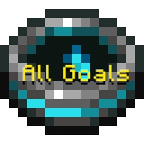
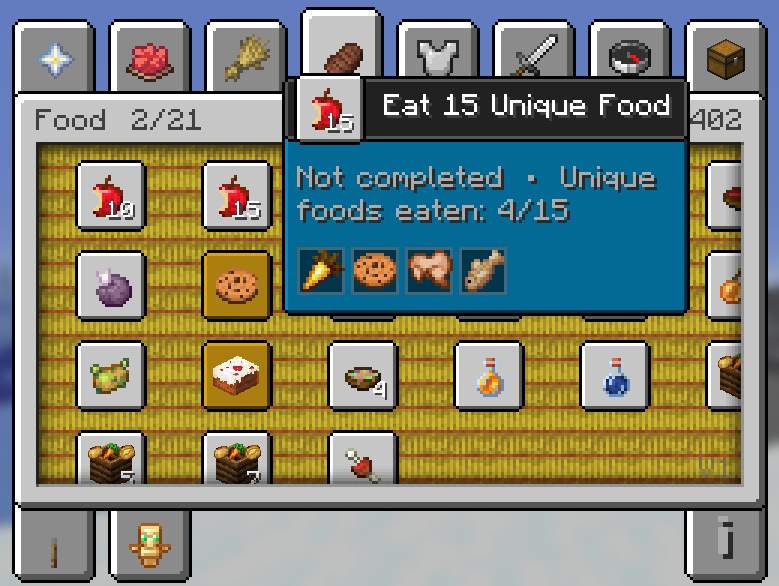
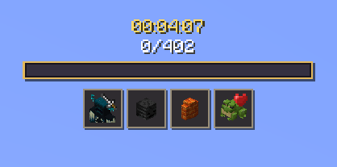
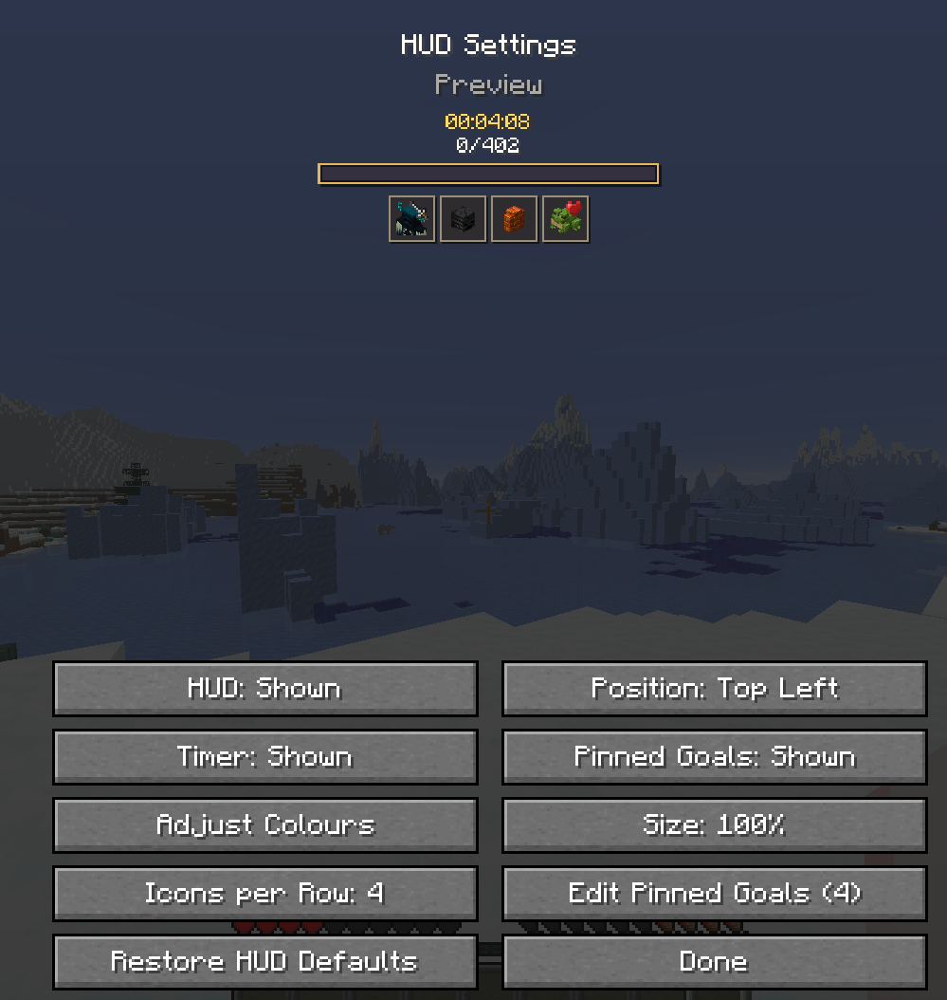

  

# All Goals by AzHEHE

### An unofficial standalone mod inspired by Draftout

**Current release: V1 (mod version 1.0.0) — for Minecraft Java Edition 26.1.1**

All Goals brings the goals players know and love from Draftout into one persistent, fully trackable Minecraft world. The challenge is simple: complete every available goal in a single run.

The mod automatically tracks 402 goals and organises them into a custom, advancement-style goal board. Its goal pool combines current Draftout goals, goals removed since the public beta, and goals normally exclusive to Draftout lobbies.

## Requirements

- Minecraft Java Edition **26.1.1**
- Fabric Loader **0.19.3 or newer**
- Fabric API **0.145.4+26.1.1 or newer**
- Java **25 or newer**

All Goals currently supports Minecraft **26.1.1 only**. In multiplayer, All Goals must be installed on the server and every connecting player's client.

## Versioning

The current goal pool is **All Goals V1**, released as mod version **1.0.0**. Because later versions may add, remove, or adjust goals as Draftout changes, completed runs should always state which All Goals version was used.

Multiplayer requires the exact same mod version on the server and every client. Each published build receives a new mod version, even when it remains part of the V1 goal pool.

## Features

- Automatic tracking for 402 goals
- Goals from Draftout's current, retired, and lobby-exclusive pools
- Custom goal board with neatly organised categories
- Customisable progress HUD with a timer and pinned goals
- Independent sound and announcement settings
- Singleplayer, LAN, and dedicated-server support
- Persistent multiplayer parties with shared progress
- World leaderboard for individuals and parties
- Hardcore support for goals that normally require death
- Victory celebration after completing every goal

## Showcase

### Goal Board

### Progress HUD

### HUD Settings

## Installation

1. Install Fabric Loader for Minecraft 26.1.1.
2. Download Fabric API for Minecraft 26.1.1.
3. Place Fabric API and the All Goals JAR in the instance's `mods` folder.
4. For multiplayer, install the same All Goals build on the server and every client.

## Multiplayer Parties

Use `/party` to open the clickable party menu. Parties share goal completion, recorded unique lists, victory state, and the run timer. Party progress persists across reconnects. Each player keeps personal HUD, sound, and announcement preferences.

## Hardcore Mode

Death goals remain possible in Hardcore. When an unfinished death goal matches what would have killed the player, All Goals completes that goal and grants a one-use rescue: the player survives at half a heart with brief protection to escape the danger. A void rescue also returns the player to their respawn point or world spawn.

Once that death goal is complete in the player's active solo or shared party progress, the same cause can kill them normally. The protection applies only to unfinished death goals and does not otherwise change Hardcore mode.

## Commands

- `/allgoals` — Show current progress
- `/party` — Open party management
- `/leaderboard` — Open the world leaderboard
- `/allgoals reset confirm` — Reset your All Goals progress
- `/allgoals grant-all` — Complete every goal; requires cheats or operator permissions
- `/allgoals grant <goal_id>` — Complete one goal; requires cheats or operator permissions
- `/allgoals revoke <goal_id>` — Revoke one goal; requires cheats or operator permissions

## Questions and Bug Reports

For any questions or bug reports, DM **@azhehe** on Discord.

## Credits and Attribution

All Goals is an unofficial standalone project and is not affiliated with, endorsed by, or maintained by the Draftout team.

Full credit goes to **7rowl and Marin**, the original creators of Draftout. The goal concepts, icons, and other Draftout assets used by All Goals originate from Draftout and remain the work of their respective creators.

## Licensing

The original Java source code written for All Goals is available under the [MIT License](LICENSE).

Draftout-derived goal concepts, icons, and artwork are **not** licensed under the MIT License. They remain the work of their respective creators and are documented in [Third-Party Notices](THIRD_PARTY_NOTICES.md).
